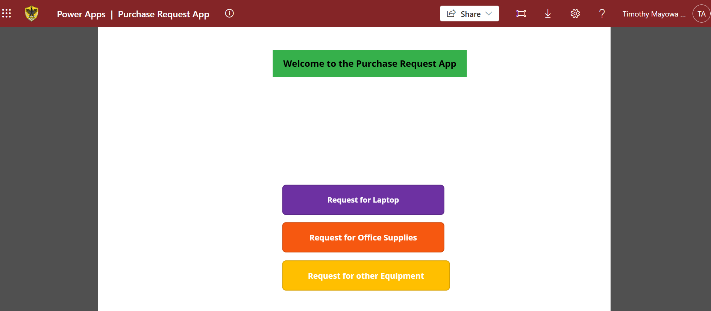
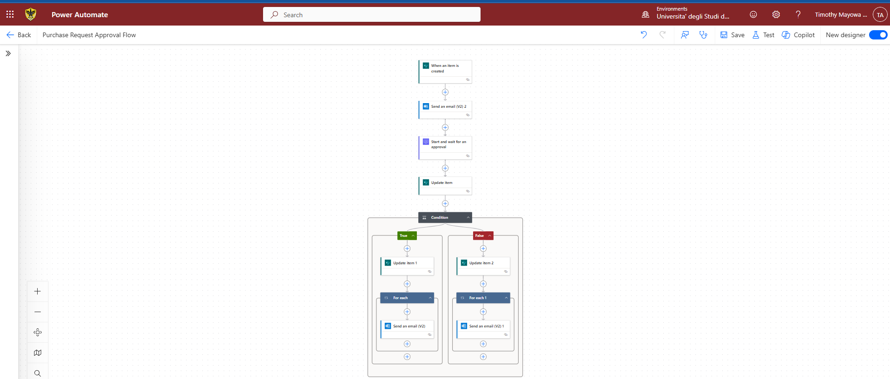
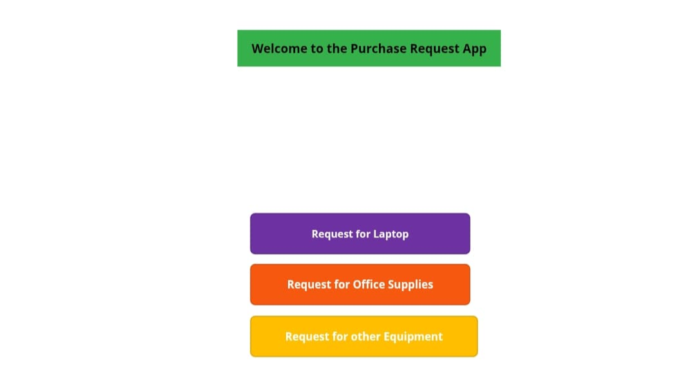
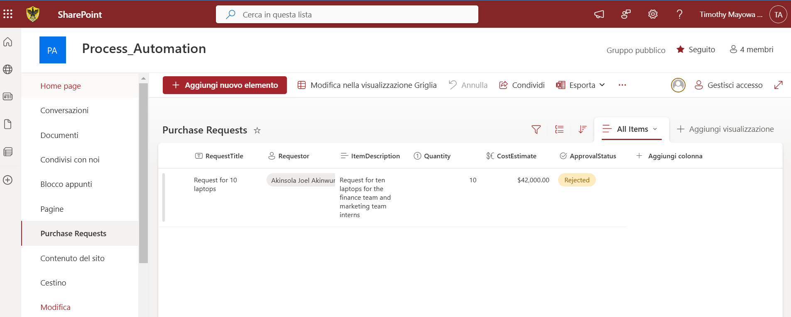
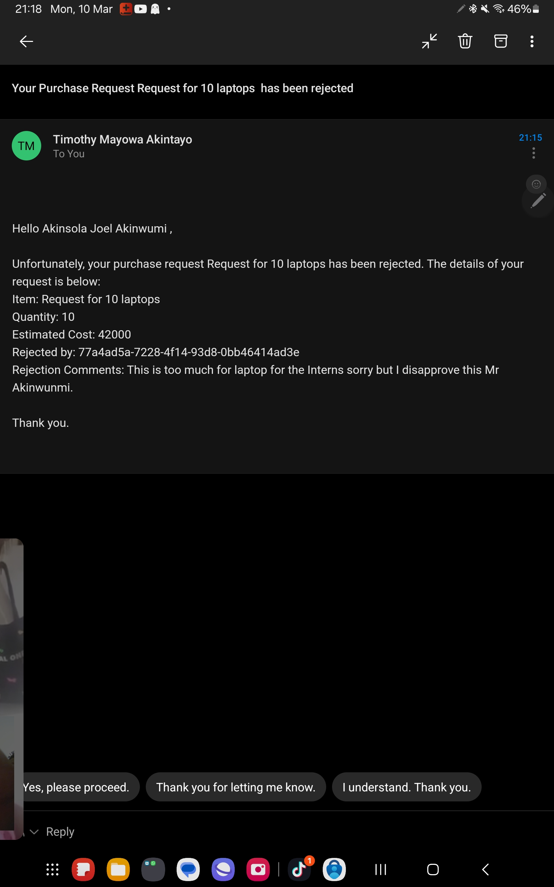

## Power Platform Purchase Request & Approval System

## Table of Contents

### 📌 Overview of the Project
This project demonstrates how organizations who already use Microsoft 365 can leverage on it's Power Platform offering to save cost on their use of expensive **Enterprise Resource Planning (ERP) Systems**. Using  **Powerapp, Power Automate and Sharepoint**, this project demonstrates the use of **Microsoft 365** in the development of a customizable, flexible and cost-effective ERP system. This project is a Purchase Request and Approval System built with Microsoft's Power Platform. It allows users to submit purchase requests via PowerApp, stores request dsata in sharepoint and automates approvals through Power Automate, notifying stakeholders via email and Microsoft Teams. It can be used on phone, tablet and computer. When linked with **Power BI**, a business intelligence and analytics tool, procurement trends in an organization such as monthly and yearly procurement trends, top-requested items to always make provision for them in advance, and approval vs rejection rate can be determined and analyzed easily.

### 💼 Business Problem
Many organizations struggle with manual purchase request approvals leading to inefficiencies, delays and lack of transparency. In worst cases, are subjected to the use of expensive **ERP** systems for their procurement and operations processes. If your organization already uses Microsoft 365 then you can safe cost on SAP Ariba through the use of Power Platform functionality by designing workflows that provides the same functionality as SAP Ariba at a fraction of the cost with faster deployment and full control over the procurement workflow and can offer real-time procurement insights when linked with Power BI. This project automates the Purchase Request and Approval process using **Powerapp, Power Automate, Office 365 and Sharepoint**, to ensure seamless approval and request processing, facilitating procurement process in any the hypothetical company named XYZ. 

#### 🚨 Challenges faced by organizations using expensive ERP systems:
* High cost (expensive licensing fees)
* Limited customization
#### ✅ Solution: PowerApps-based Procurement System:
* Cost-effective and easy to deploy.
* Uses Microsoft 365 tools (PowerApps, Power Automate, and Sharepoint).
* Automates purchase requests and approvals.

### 💡 Project Background
This project is a Purchase Request & Approval System built with Microsoft's Power Platform. It is a low-cost no-code procurement system enabling organizations using Microsoft365 to seamlessly make procurements with the help of an end-to-end procurement automation for approvals and analytics of procurement operations. It enables users to submit purchase requests via the PowerApps which is available for tablet and phones, stores data in sharepoint and automates approvals using Power Automate, notifying staffs via emails and microsoft teams about requests in three categories which are:
* Request for Laptop
* Request for Office Supplies
* Request for other Equipment.
The system ensures the following:
- Faster Approvals (First-to-Respond Mechanism.
- Role-Based Access(Requestor, Approver, Admin).
- Seamless Integration with Microsoft 365 ecosystem.

### 🛠️ Tools Used:
* [PowerApp](https://make.powerapps.com/): This was used to customize the forms for the request submission
* [Sharepoint](https://www.microsoft.com/en-us/microsoft-365/sharepoint/collaboration): This is the data storage for the request made in the organization
* [Power Automate](https://make.powerautomate.com/): This was used to automate the approval workflows.
* Office 365 Groups & Teams: This was used for communication and notification of requests.

### Skills Demonstrated
In this project, i showcase my expertise in the following:
- Power Apps; Designed three custom forms with dropdowns, combo boxes and conditional logic.
- Power Automate; Created approval workflows with dynamic email routing 
- Sharepoint: Developed a robust data source for request tracking using Sharepoint site and list.![
- Microsoft 365: Placed users in the organization into groups, to enable user permissions and notifications.
- Troubleshooting & Debugging: Debugged errors in forms, email notifications and approval workflow.

### 📝 What does this application have?
The application consists of a home screen which welcomes users to the app and the three categories of request listed earlier. From the home screen, users can navigate to these 3 categories, back buttons which allows you to go back to the previous request section alongside a home button to navigate to the home screen and a submit button which allows you to automatically submit your request in the application, sending the request to the stakeholders in the organization with a first to respond option enabled, making the approval system easy without waiting on a specific individual.
### Live Demo
In this section, I leave you with a video tour of the app. I am hoping it interests you, and you would sometime like to build your own application not necessarily a purchase app, it could be an event registration app, a chatbot for customer service, and lots more.
- Demo Video [video]()

### 💾 Data Structure & Storage
- 📂 SharePoint Lists (used as a database)
- Purchase Requests (Stores all request details made from the purchase request app)
- Approval Status (Tracks all approval progress from pending to approved)
- Office 365 Users (Retrieves dynamic university of L'Aquila users data from office 365)

  ### 📊 Key Columns Needed for the Automation

|Column Name                      | Data Type                                   |Purpose                      |
|  ------------------------------ | ------------------------------              | ------------------------------ |
| Request Title        | Single line of text                 | A short title for the request (e.g. "New Laptops for Finance") |
| Requestor Name       | Person                              | The person who made the request                         |
| Item Description     | Multiple lines of text              | Details about the item being requested                  |
| Quantity             | Number                              | How many items are needed                               |
| Cost Estimate        | Currency                            | The estimated total cost                                |
| Approval Status      | Choice (Pending, Approved, Rejected) | The current status of the request |

#### 🔄 Workflow Automation with PowerApp and Power Automate
- User logs in to the [Purchase Request App](https://apps.powerapps.com/play/e/default-9df08a7c-31d7-4024-9ba6-5ed5efac1a01/a/115cfafe-6479-41bf-ad86-28ce3463cc45?tenantId=9df08a7c-31d7-4024-9ba6-5ed5efac1a01&hint=b4b94d79-bef1-417d-8daf-44bf2f27b0a5&source=sharebutton&sourcetime=1741626481123) on their phone 📱, tablet or laptop
- User gets welcomed with the homescreen 
- User submits 
- Submitted request is sent and saved in SharePoint.
- Power Automate triggers the approval workflow, sending the request to a Microsoft 365 group (first responder approval system) 
- Approval/rejection is updated in sharepoint.
- Email & Teams notifications sent to the requestor and the group.
### 🔑 Key Configurations
- Default Approval Status = "Pending"
- Approvals receive a request via Outlook and Teams
- Approval/Rejection is done based on First-to-Respond logic

### 🚀 Deployment and Usage
- Publish PowerApps: Share the app with users in the organization.
- Grant Power Automate Access: Ensure the workflow has permissions to run

  ### Analysis & Key Learnings
  - User Selection Challenge: Initially, requestor selection as drop down list did not work as it showed as items with no names. This was fixed using some formulas in the datacard of the combo box.
  - Email Visibility Issue: The group email received notifications initially but members were not getting individual emails. This was fixed by fetching all group members and sending individual emails via Power Automate.
  
### Conclusions and Recommendations
This project streamlined purchase request approvals by eliminating manual processes, reducing delays and ensuring accountability.

### ✅ Impact & Benefits
- Faster Approvals: Requests are processed in real-time using first-to-respond logic.
- Improved Transparency: Requestors track progress via Sharepoint updates.
- Scalability: This project is easily extendable to organizations who might require additional approval levels or multiple approvals as opposed to a first-to-respond logic system.

 ## 🚀 Future Enhancement
📌 Implementation of Multi-Level Approvals: Implementing a tiered approvals can be beneficial to large organizations or for high-cost procurements which might require going through different levels of approvals.
📌 Mobile Optimization: Improve PowerApps responsiveness and UI/UX for mobile users.
📌 Dashboard & Analytics: Test with several requestors, and link the request data to PowerBI dashboard to develop a real-time purchase and procurement dashboard that tracks trends in procurement and offers the organization insight into items most requested at different periods.

### 📢 How to Use the System
- Step 1: Open PowerApps → Fill out the request form
- Step 2: Submit the request → It saves in SharePoint
- Step 3: Approval notification is sent via Teams & Email
- Step 4: Approver accepts/rejects → Status updates in SharePoint
- Step 5: Requestor receives confirmation

     

