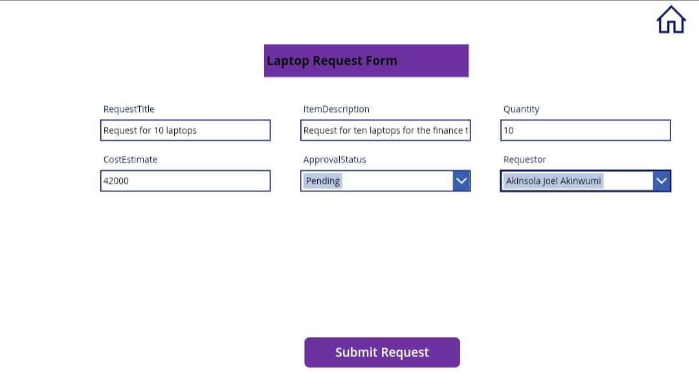

## Power Platform Purchase Request & Approval System

## Table of Contents
- [Business Problem and Overview of the Project](#business-problem-and-overview-of-the-project)  
- [Impact and Benefits](#impact-and-benefits)  
- [About the Project](#about-the-project)  
- [Tools Used](#tools-used)  
- [Skills Demonstrated](#skills-demonstrated)  
- [Data Structure and Storage](#data-structure-and-storage)  
- [Key Columns Used for the Automation](#key-columns-used-for-the-automation)  
- [Workflow Automation with PowerApps and Power Automate](#workflow-automation-with-powerapps-and-power-automate)  
- [Challenges and Solutions](#challenges-and-solutions)   
- [Future Enhancements](#future-enhancements)  
- [How to Use the System](#how-to-use-the-system)
- [Video Demo](#video-demo)
- [Conclusion](#conclusion)  

### Business Problem and Overview of the Project
Many organizations struggle with manual purchase requests, causing delays and inefficiencies. Others use expensive ERP systems which come with high costs and limited flexibility. This project demonstrates how organizations can leverage on Microsoft Power Platform to develop customizable, flexible and cost-effective ERP system. It is a Purchase Request and Approval System built with Microsoft's Power Platform which llows users to submit purchase requests via PowerApp and get real-time response and tracking of their requests allowing for efficiency of procurement operations in any organization.

### Impact and Benefits
- Faster Approvals: Requests are processed in real-time using first-to-respond logic.
- Improved Transparency: Requestors track progress via Sharepoint updates.
- Scalability: This project is easily extendable to organizations who might require additional approval levels or multiple approvals as opposed to a first-to-respond logic system.

### About the Project
This project is a Purchase Request & Approval System built with Microsoft's Power Platform. It is a low-cost low-code procurement system enabling organizations using Microsoft365 to seamlessly make procurements with the help of an end-to-end procurement automation for approvals and analytics of procurement operations. It enables users to submit purchase requests via the PowerApps which is available for tablet and phones, stores data in sharepoint and automates approvals using Power Automate, notifying staffs via emails and microsoft teams about requests in three categories which are:
* Request for Laptop
* Request for Office Supplies
* Request for other Equipment.
The system ensures the following:
- Faster Approvals (First-to-Respond Mechanism.
- Role-Based Access(Requestor, Approver, Admin).
- Seamless Integration with Microsoft 365 ecosystem.

### Tools Used
* [PowerApp](https://make.powerapps.com/): This was used to customize the forms for the request submission
* [Sharepoint](https://www.microsoft.com/en-us/microsoft-365/sharepoint/collaboration): This is the data storage for the request made in the organization
* [Power Automate](https://make.powerautomate.com/): This was used to automate the approval workflows.
* Office 365 Groups & Teams: This was used for communication and notification of requests.

### Skills Demonstrated
In this project, i showcase my expertise in the following:
- Power Apps; Designed three custom forms with dropdowns, combo boxes and conditional logic.
- Power Automate; Created approval workflows with dynamic email routing 
- Sharepoint: Developed a robust data source for request tracking using Sharepoint site and list.![
- Microsoft 365: Placed users in the organization into groups, to enable user permissions and notifications.
- Troubleshooting & Debugging: Debugged errors in forms, email notifications and approval workflow.

### Data Structure and Storage
- 📂 SharePoint Lists (used as a database)
- Purchase Requests (Stores all request details made from the purchase request app)
- Approval Status (Tracks all approval progress from pending to approved)
- Office 365 Users (Retrieves dynamic university of L'Aquila users data from office 365)

  ### Key Columns Used for the Automation

|Column Name                      | Data Type                                   |Purpose                      |
|  ------------------------------ | ------------------------------              | ------------------------------ |
| Request Title        | Single line of text                 | A short title for the request (e.g. "New Laptops for Finance") |
| Requestor Name       | Person                              | The person who made the request                         |
| Item Description     | Multiple lines of text              | Details about the item being requested                  |
| Quantity             | Number                              | How many items are needed                               |
| Cost Estimate        | Currency                            | The estimated total cost                                |
| Approval Status      | Choice (Pending, Approved, Rejected) | The current status of the request |

### Workflow Automation with PowerApps and Power Automate
- User logs in to the [Purchase Request App](https://apps.powerapps.com/play/e/default-9df08a7c-31d7-4024-9ba6-5ed5efac1a01/a/115cfafe-6479-41bf-ad86-28ce3463cc45?tenantId=9df08a7c-31d7-4024-9ba6-5ed5efac1a01&hint=b4b94d79-bef1-417d-8daf-44bf2f27b0a5&source=sharebutton&sourcetime=1741626481123) on their phone 📱, tablet or laptop
- User gets welcomed with the homescreen 
- User submits request for laptop
- Submitted request is sent and saved in SharePoint.
- Power Automate triggers the approval workflow, sending the request to a Microsoft 365 group (first responder approval system) 
- Approval/rejection is updated in sharepoint.
- Email & Teams notifications sent to the requestor and the group.

### Challenges and Solutions
  - User Selection Challenge: Initially, requestor selection as drop down list did not work as it showed as items with no names. This was fixed using some formulas in the datacard of the combo box.
  - Email Visibility Issue: The group email received notifications initially but members were not getting individual emails. This was fixed by fetching all group members and sending individual emails via Power Automate.

 ### Future Enhancements
- Implementation of Multi-Level Approvals: Implementing a tiered approvals can be beneficial to large organizations or for high-cost procurements which might require going through different levels of approvals.
- Mobile Optimization: Improve PowerApps responsiveness and UI/UX for mobile users.
- Dashboard & Analytics: Test with several requestors, and link the request data to PowerBI dashboard to develop a real-time purchase and procurement dashboard that tracks trends in procurement and offers the organization insight into items most requested at different periods.

### How to Use the System
- Step 1: Open PowerApps → Fill out the request form.
- Step 2: Submit the request → It saves in SharePoint.
- Step 3: Approval notification is sent via Teams & Email.
- Step 4: Approver accepts/rejects → Status updates in SharePoint.
- Step 5: Requestor receives confirmation.
### Video Demo
In this section, I leave you with a video tour of the app. I am hoping it interests you, and you would sometime like to build your own application not necessarily a purchase app, it could be an event registration app, a chatbot for customer service, and lots more.
- Demo Video [video]()

### Conclusion  
This project eliminates manual inefficiencies in purchase approvals, reduces costs, and ensures real-time tracking. By leveraging **PowerApps, Power Automate, and SharePoint**, organizations can streamline procurement process at low-cost.

     

